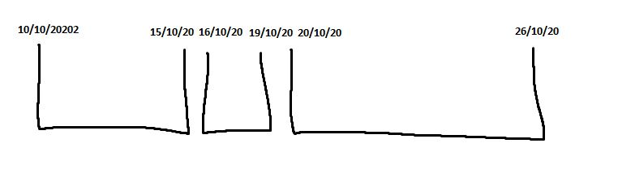
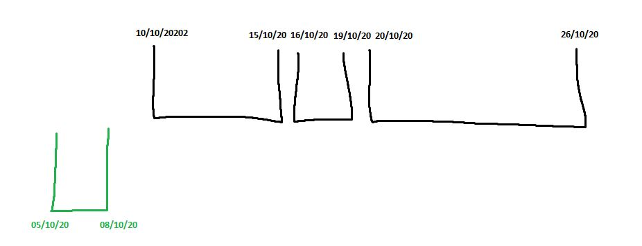
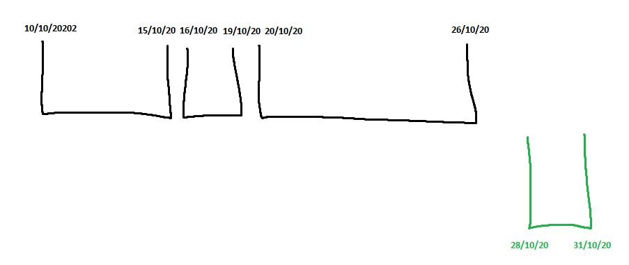
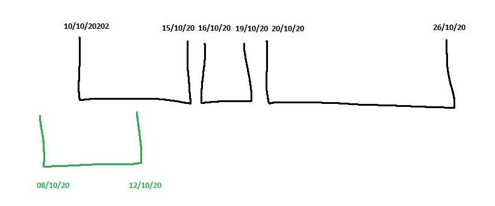
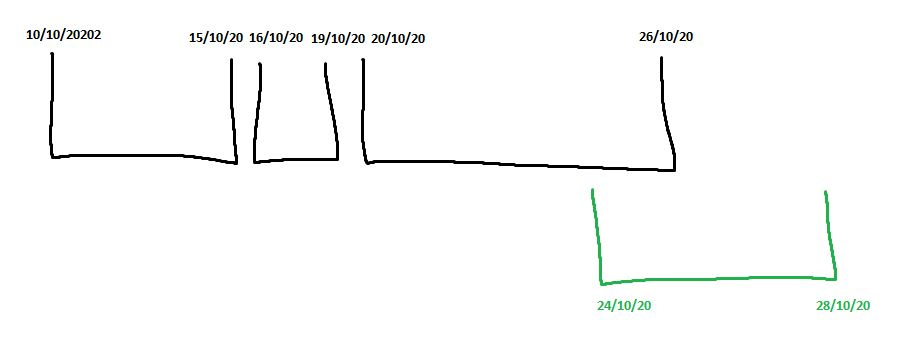
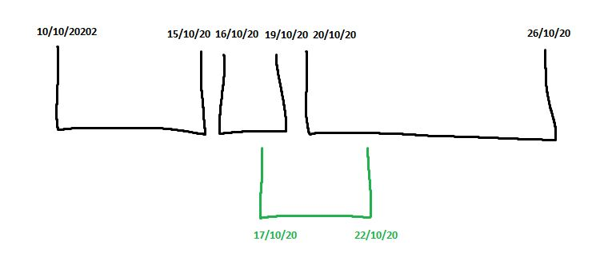
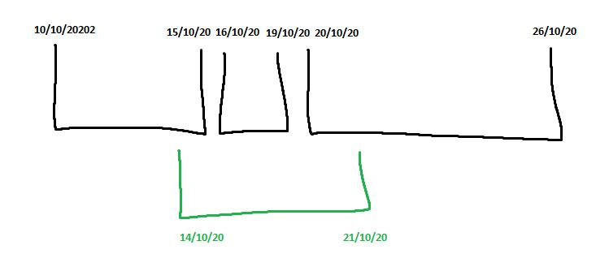
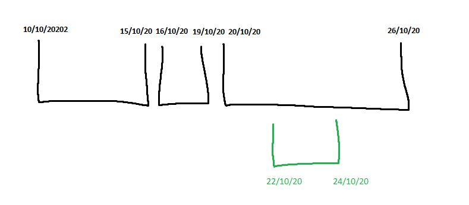

## The base planning

We have a base planning with 3 period, each one following each others

- first: from **10/10/20** to **15/10/20**
- second: from **16/10/20** to **19/10/20**
- third: from **20/10/20** to **26/10/20**

# Test cases

Here are all the test case covered in the test suite

# Insert a new period at the start of the planning

# insert a new period at the end of the planning

# insert a new period at the start of the planning overlapping the start of the first period

# insert a new period at the end of the planning overlapping the end of the last period

# insert a new period at the middle of the planning overlapping two different period

# throw an error because the new period wrap an existing period

# throw an error because the new period is within an existing period

